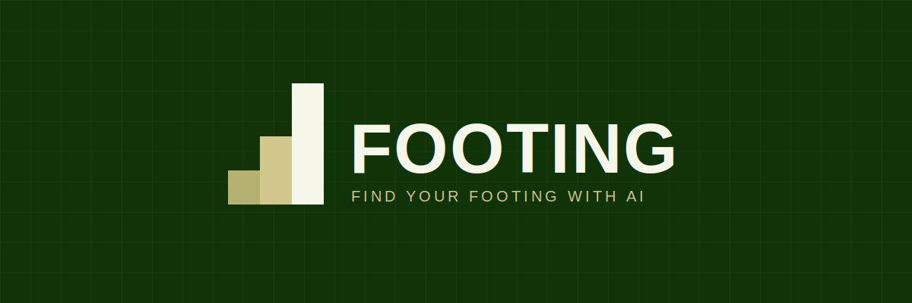

<p align="center">
  
</p>

# Footing

"Get your footing" is the moment you stop slipping and stand on solid ground. For an established business bringing AI into how it already operates, that's the hard part. Not the tools themselves, but knowing where to plant your feet: what to hand over, what to keep to yourself, and how to set the whole thing up so it still makes sense in six months.

Footing gives you that solid ground in an evening.

It is an installable Obsidian vault pack for businesses, charities, and small firms putting AI to work for the first time. One command lays down a working second-brain: folder structure, page templates, skills, and a short set of reference pages researched for your specific sector at setup time. Walk into Monday with a knowledge system that already understands your business, your priorities, and the landscape you operate in.

The structure is built to slot into Anthropic's Cowork. A Footing vault opened in Obsidian, with Cowork running alongside, gives a small business something that, until recently, needed a dedicated team to put together.

The operations still have to be run. Footing is the ground you run them from.

## What you get

- A one-line setup prompt that installs the whole pack with no marketplace or plugin required.
- A short, live-researched set of reference pages for your own sector, built at setup time and written straight into your vault, not shipped as generic pre-packaged content.
- A re-runnable `rename` step that whitelabels the pack to your name.
- A manual `update` command for pulling new content as Footing evolves.
- Skills for the high-frequency adds: events, contacts, organisations.
- A working set of business-method skills (prioritisation, positioning, research synthesis, and more), stripped of any sector-specific framing so they apply to whatever you do.

## Audience

Owners, operators, and senior leaders at established businesses, charities, and small firms introducing AI into how they already work. Not early-stage founders starting from zero. Free and available to all. Hands-on setup and ongoing support are available at a modest cost.

## Getting started

This is the install walkthrough. The whole thing takes about ten to fifteen minutes once you have Cowork and Obsidian open.

### What you'll need

- **A paid Claude subscription, with Cowork.** Cowork is Anthropic's desktop app for non-developers, and it runs inside a paid Claude plan. Sign up and subscribe at [claude.com](https://claude.com), then download the Claude desktop app; Cowork is a tab inside it. There is a running cost here: budget for one Claude subscription per person who will run the vault.
- **Obsidian.** Free knowledge management app. Download from [obsidian.md](https://obsidian.md). Obsidian Sync, used for keeping a vault in step across devices or people, is a paid add-on; a free alternative is covered under Scaling across a team below.

### Step 1 — Run the setup

Open a new Cowork chat and paste the following:

```
Fetch https://raw.githubusercontent.com/MilUX-Ltd/footing/main/footing/skills/footing-setup/SKILL.md and follow the instructions in it exactly.
```

The skill takes over from here. It will:

1. **Lay down your vault.** Create a folder structure at `~/Obsidian/Footing/` (or a custom path if you specify one). Silent step, takes a few seconds.
2. **Ask seven quick questions.** One at a time. Each has quick-pick options plus an "Other" option for free text. Skip any you want. The questions cover who you are, your sector, what you do and who buys it, what sets you apart, your voice, your current priorities, and your tool stack.
3. **Research your sector.** If you answered the sector question, the skill runs a short, live round of research and writes a small set of reference pages, an overview and, where genuinely relevant, a framework or portal page, straight into your own vault. This is generated fresh for you at install time, not pulled from a shared library.
4. **Offer a context drop.** One further question inviting you to paste links, upload files, or point at a local folder of source material. The more you give it, the more personalised your vault will be.
5. **Build your canonical pages.** Silently. The skill drafts your operator profile, brand and strategy pages, email signature, and voice notes from the answers and corpus.
6. **Offer to schedule updates.** Final question asking whether you want `/footing-update` to run automatically on a weekly or monthly cadence. Pick a cadence and the skill sets up the scheduled task for you; pick manual and you trigger updates yourself.

When the skill finishes, it tells you where the vault was created, what sector-landscape pages (if any) it built, and which schedule (if any) is now in place.

### Step 2 — Open your vault in Obsidian

1. Launch Obsidian.
2. Click "Open folder as vault".
3. Point at your new Footing vault folder (default: `~/Obsidian/Footing/`).
4. Click "Open".

Your vault is live. The top-level folders appear in the sidebar.

## Keeping your pack up to date

Footing evolves. New skills land and existing pages get sharpened. After your initial install, all updates happen through a skill that lives inside your vault, no marketplace refreshing, no plugin reinstalling, no Cowork restarting.

### How to trigger an update

1. Open Cowork and make sure it's pointed at your Footing vault folder. Cowork picks up the vault's skills automatically from the vault's `Skills/` folder.
2. In a Cowork chat, type:

   ```
   /footing-update
   ```

   Or ask in natural language: "update Footing", "pull the latest from the Footing repo", "see if there's anything new in Footing". Any of those triggers the same skill.

3. The skill goes straight to the public Footing repository on GitHub via a plain HTTPS request and compares what's there to what you have. It works out the state of every file: new on GitHub, changed upstream since you last pulled, edited locally, or in conflict (you've edited and so has upstream). You're told what's safe to apply automatically and asked what to do about anything you've personalised.
4. When it finishes, you'll see a short report of what was added, what was updated, what was merged, and what was left alone.

Your sector-landscape pages, built during setup, are yours. They're generated once at install time from live research, not pulled from the repo, so `/footing-update` never touches them.

### Why this works without any setup

The `/footing-update` skill lives at `Skills/footing-update/SKILL.md` inside your vault. It was placed there by the initial `/footing-setup` run. Cowork sees it the moment your vault is open. The skill makes a plain HTTPS request to the public Footing GitHub URLs, no GitHub account, no auth, no Terminal, no Git on your machine.

### How conflicts are handled

The update skill is a three-way reconcile. It tracks the SHA (the GitHub blob identifier) of every file at the moment it was last pulled to your vault, stored in `.footing/config.yml` under `last_known_shas:`. On each run, it compares three things per file: what was last pulled, what's currently on GitHub, and the SHA of the version sitting in your vault right now.

That tells it which of these situations each file is in:

- **Untouched both sides.** Skip, nothing to do.
- **Upstream-only change.** You haven't edited the file; upstream has. Safe to apply, applied by default with a chance to veto.
- **Local edit only.** You've edited; upstream hasn't changed. Skip, there's nothing new to bring in.
- **New on GitHub.** Add it.
- **Conflict.** You've edited the file AND upstream has new changes. You're asked per file: take theirs (overwrite local), keep mine (skip), or merge (the skill proposes a combined version that integrates upstream's changes into your edited file and asks you to confirm before writing).

Your personalised content is never overwritten without an explicit yes from you.

## What's next

In the first hour, focus on:

1. **Open `Context/<your name>.md`.** Check the operator profile reads well. Revise anything that needs sharpening.
2. **Read your sector-landscape pages**, if the setup skill built any, under `Intelligence/sector-landscape/`. They're a starting point for your own research, not a finished picture.
3. **Read the per-folder Guides.** Every folder has a `<Folder Name> Guide.md` at its root. Knowledge Guide, Operations Guide, Context Guide, and CRM Guide are the load-bearing ones.
4. **Connect Cowork to your vault.** Point Cowork at your new vault folder. Cowork and Obsidian now work against the same files; agents you run in Cowork write into the vault, and you see them in Obsidian.

## Scaling across a team

Footing is built for a single operator. The setup interview asks who *you* are, the pages are *your* profile, and the update model assumes one person reconciling their vault against upstream. That is the right starting point. It is worth knowing what changes when a second or third person comes in, before you get there.

The main considerations:

- **One shared vault, or one per person.** A single shared vault keeps everyone on the same canonical knowledge, at the cost of coordinating edits. Separate per-person vaults stay simple individually but drift apart over time. Most small teams want a shared vault for reference content (sector landscape, CRM, strategy) and accept that personal working notes can live wherever suits.
- **How the vault syncs between people.** Obsidian Sync is the paid, no-setup option. A private Git repository is the free alternative and gives you version history, at the cost of a little more setup. Pick one before two people are editing, not after.
- **Who curates canonical knowledge.** Name one curator. Footing's value is that its reference content is trustworthy; that holds only if changes go through someone. Without a curator, a shared vault fills with half-finished and contradictory pages.
- **Write boundaries.** Decide who can write where, and keep agents on a tighter rein than people. A common pattern: everyone can read everything, drafts land in a staging area, and only the curator promotes a draft into the canonical folders.
- **The update conflict model is per person.** `/footing-update` reconciles one vault against upstream. If several people share a vault, agree that only one person runs updates, and avoid two people editing the same file in the same window, or the three-way reconcile has more to untangle.
- **One Claude subscription each.** Everyone running the vault through Cowork needs their own paid Claude plan. Factor that into the cost as the team grows.

None of this is needed on day one. Set the vault up as a single operator, get value from it, and come back to this section when a second person is ready to join.

## Tools

Standalone tools that ship with Footing but install nothing live in [`tools/`](tools/).

- **[Vault Viewer](tools/vault-viewer/)** (v1.0.0). A single HTML file that reads a Footing vault, or any folder of Markdown notes, like a website. No install, no cloud, no Obsidian. Wikilinks, search and backlinks all work, and it runs fully offline with no network requests. Use it to hand a vault to someone who does not have Obsidian, or to read your own on a machine that does not. Download `tools/vault-viewer/vault-viewer.html`, open it in Chrome, Edge or Brave, and point it at a folder. See the [tool README](tools/vault-viewer/README.md) for detail.

## Share back

Footing gets better the more it's actually used. If a page reads oddly, a skill misfires, a question in the setup walkthrough doesn't fit your kind of business, or you hit a rough edge anywhere in the install, tell Matt. A line on LinkedIn, an email, or a screenshot will do. Fixes and improvements go into the next update so everyone else running the pack gets the benefit.

Email: matt@milux.co.uk. LinkedIn: [Matt Odell](https://www.linkedin.com/in/mattodell/).

## Troubleshooting

**The install skill leaves `{{placeholder}}` text in some files** — That's a bug. Tell Matt which files and which placeholder, and we'll fix it.

**Obsidian doesn't see the vault** — Make sure you point "Open folder as vault" at the Footing root, not at a subfolder.

**Anything else** — Email Matt at matt@milux.co.uk or open an issue at https://github.com/MilUX-Ltd/footing/issues.

## Help

- Email: matt@milux.co.uk
- GitHub issues: https://github.com/MilUX-Ltd/footing/issues
- LinkedIn: [Matt Odell](https://www.linkedin.com/in/mattodell/)

## Provenance

Footing is built by [MilUX](https://milux.co.uk), and is the general-business sibling of MilUX's defence-sector pack, Foothold. Its structure, conventions, and skills come from MilUX's own working vault. It improves with every contribution from people running it, if you find something worth fixing or adding, see [Share back](#share-back).
